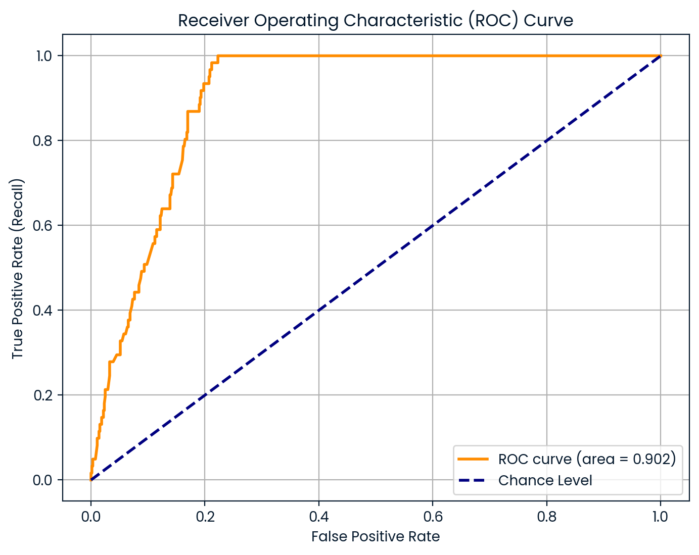

# XGBoost-based dengue case classification in Brazilian pediatric cohort using clinical and household features

## Description

This repository contains a machine learning pipeline to classify symptomatic dengue cases among children and adolescents in Araraquara, Brazil. To predict dengue infection, the XGBoost-based model leverages a minimal set of interpretable features: crowding index (household density), average fever duration, and age. The notebook includes feature engineering, hyperparameter tuning via Bayesian optimization, threshold tuning, and evaluation with comprehensive metrics.

## Overview

- Data filtering and preprocessing pipelines tailored for clinical and household data.
- Feature engineering to derive crowding index and aggregate fever features.
- Handling imbalanced classes using weighted training.
- Bayesian optimization for hyperparameter tuning of the XGBoost model.
- Classification threshold tuning to maximize F1 score.
- Detailed evaluation including precision, recall, accuracy, F1, ROC-AUC.
- Visualization of model discrimination by ROC curve.

## File Structure

- `dengue-bra-crowdingindex-f.ipynb`: Complete notebook with data processing, model training, tuning, evaluation, and visualization.
- `roc-dengue-brazil-crowdingbased.png`: ROC curve generated from the notebook.

## Graphical Summary

Below is the ROC Curve obtained from the test dataset, showing strong model discrimination with an AUC around 0.9:

  
Figure 1. Receiver operating characteristic curve (ROC) curve image generated by the notebook at runtime. This is an ROC curve depicting the diagnostic performance of the XGBoost classifier on the test dataset. The curve demonstrates strong discriminative ability with an area under the curve (AUC) of 0.902.

## License

This project is licensed under the MIT License.

## Questions?

I'd love to hear your thoughts on this project! If you happen to have questions, send them my way at jprmaulion[at]gmail[dot]com.
